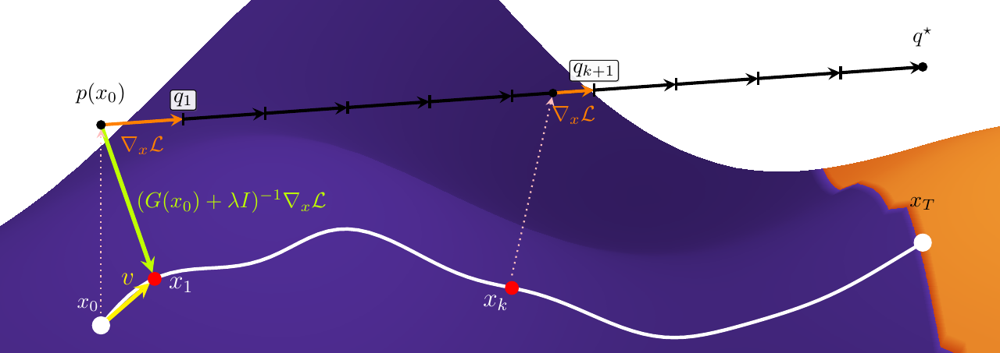
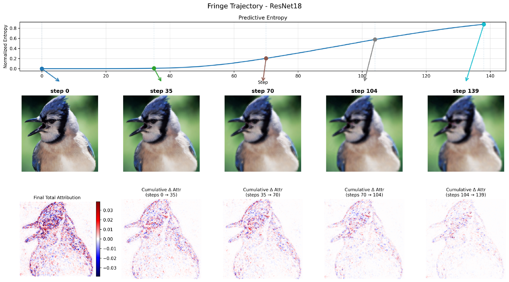
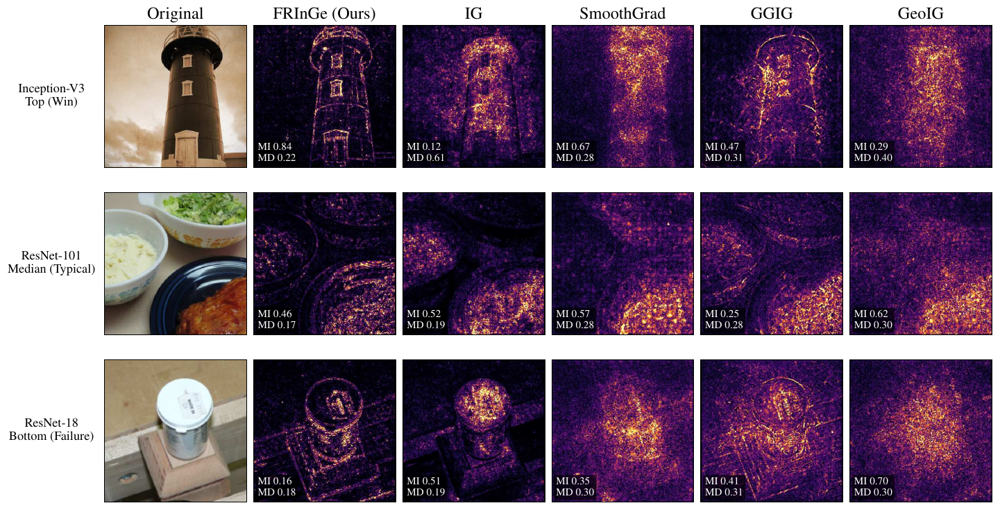

# FRInGe: Distribution-Space Integrated Gradients with Fisher–Rao Geometry

**FRInGe** is a gradient-based attribution method that defines both its reference and its interpolation
schedule in the model's predictive distribution space. It replaces a hand-designed input baseline with a
maximum-entropy predictive reference, follows a Fisher–Rao geodesic on the probability simplex, and
realizes that path in input space through a regularized pullback Fisher metric.

<p align="center">
  
</p>

<p align="center"><em>
FRInGe prescribes a geodesic from the model prediction to a maximum-entropy reference and tracks its
waypoints through the classifier's pullback geometry.
</em></p>

> **Research-code status.** This repository provides the benchmark-facing categorical FRInGe
> implementation and its FRInGe-B target-vs-rest specialization, together with evaluation metrics and
> the architecture-specific hyperparameters used in the experiments. The API may still change while
> the research release is being finalized.

## Why FRInGe?

Standard Integrated Gradients requires an input-space baseline and usually follows a Euclidean straight
line. Both choices can be problematic: the baseline may not represent missing information, while the path
may cross saturated or poorly conditioned regions. FRInGe changes the construction in five steps:

1. **Predictive reference:** use the uniform categorical distribution as a maximum-entropy endpoint.
2. **Intrinsic schedule:** connect the prediction to that endpoint with a Fisher–Rao geodesic.
3. **Pullback realization:** map each predictive waypoint back to an input update through the model's
   pullback Fisher metric.
4. **Stable updates:** combine damping, spatial regularization, a KL/Fisher trust region, and a Euclidean
   step cap.
5. **Path attribution:** integrate the target-score gradient along the realized input trajectory.

Full categorical FRInGe solves the inner linear system with preconditioned conjugate gradients (PCG),
without forming the input-space Fisher matrix. FRInGe-B instead exploits the rank-one target-vs-rest
pullback: its unsmoothed direction is closed form, while its smoothed variant requires only structured
regularizer solves.

## Which implementation is canonical?

The benchmarking entry point is
[`FisherRaoIG/FisherRaoIntegratedGradients.py`](FisherRaoIG/FisherRaoIntegratedGradients.py). Its
`binary=False` branch implements full categorical FRInGe. Setting `binary=True` delegates to
[`FisherRaoIG/BinaryFisherRaoIntegratedGradients.py`](FisherRaoIG/BinaryFisherRaoIntegratedGradients.py),
which implements FRInGe-B. The binary module is therefore a required backend, not a replacement for the
benchmark-facing class.

The older `BiharmonicFisherRaoIntegratedGradients.py` module is retained only for its high-instrumentation
visualization workflow; it is not the implementation used to produce the benchmark results.

## What the trajectory looks like

<p align="center">
  
</p>

The predictive entropy increases toward the maximum-entropy endpoint while evidence for the target class
is progressively attenuated. The bottom row shows when attribution is accumulated along this trajectory.

## Qualitative comparison

<p align="center">
  
</p>

The figure includes a strong case, a typical case, and a representative failure case rather than showing
only favorable examples. `MI` and `MD` denote image-level MAS-Insertion and MAS-Deletion, respectively.
Across the manuscript's six ImageNet architectures, FRInGe's clearest and most consistent advantage is on
calibration-oriented MAS metrics; perturbation AUC results are more mixed.

## Installation

Python 3.10 or newer is recommended. A CUDA-capable GPU is strongly recommended because FRInGe performs
repeated Jacobian-vector products and iterative linear solves.

```bash
git clone https://github.com/GabMartino/FRInGe.git
cd FRInGe

python3 -m venv .venv
source .venv/bin/activate
python -m pip install --upgrade pip
python -m pip install -r requirements.txt
```

Torchvision downloads pretrained ImageNet weights the first time a model is loaded.

Verify the categorical and binary implementations with:

```bash
python -m unittest discover -s tests -v
```

## Quick start

The following example explains the top-1 prediction of a pretrained ResNet-18 using the categorical
implementation and its benchmarked ResNet-18 hyperparameters.

```python
import torch

from FisherRaoIG.FisherRaoIntegratedGradients import FisherRaoIntegratedGradients
from utils import load_image, load_model


device = "cuda" if torch.cuda.is_available() else "cpu"
model, preprocess = load_model("resnet18", device=device)
x = load_image("examples/n01580077_jay.JPEG", preprocess, device=device)

with torch.no_grad():
    target = model(x).argmax(dim=1)


def target_score(inputs: torch.Tensor, targets: torch.Tensor) -> torch.Tensor:
    return model(inputs).gather(1, targets[:, None]).squeeze(1)


explainer = FisherRaoIntegratedGradients(
    model=model,
    model_forward=target_score,
    target_idx=target,
    cg_max_iters=20,
)

attributions, completeness_delta = explainer.attribute(
    x=x,
    kl_target=3.0339e-4,
    fisher=True,
    binary=False,
    delta_euc=0.61337,
    eta_max=13.56315,
    use_sobolev_preconditioner=True,
    lambda_ratio=4.7707e-11,
    smoothing=True,
    gamma_step=0.0099739,
    gamma_prior=0.00097495,
)

print(attributions.shape)
print("Mean completeness residual:", completeness_delta)
```

The complete categorical and binary parameter sets for all six architectures are recorded in
[`config/ablation/3_fisher_smooth.yaml`](config/ablation/3_fisher_smooth.yaml) and
[`config/ablation/fringe2_binary.yaml`](config/ablation/fringe2_binary.yaml), respectively. These are
experiment-specific settings rather than universal defaults.

## Outputs and diagnostics

The benchmark-facing categorical call returns the attribution tensor and its mean absolute completeness
residual. The FRInGe-B backend additionally records per-example diagnostics including:

- target probability, target log-odds, and requested waypoints;
- Fisher–Rao and Euclidean step norms;
- active trust-region constraints;
- regularizer-inverse iteration counts;
- completeness and endpoint errors, including the full categorical KL to uniform.

When FRInGe-B is selected through the canonical wrapper, the full dictionary is available as
`explainer.last_binary_stats` after attribution.

## Evaluation metrics

The `metrics/` package includes:

- blur-based insertion and deletion AUC;
- Magnitude Aligned Scoring (MAS) for insertion and deletion;
- infidelity;
- max sensitivity;
- Gini sparseness.

Metrics and perturbation choices answer different questions. In particular, MAS evaluates whether
attribution magnitude tracks the model's confidence response, whereas insertion/deletion AUC primarily
evaluates the induced feature ranking.

## Repository layout

```text
FisherRaoIG/
  FisherRaoIntegratedGradients.py            # canonical benchmark-facing API
  BinaryFisherRaoIntegratedGradients.py      # FRInGe-B backend
  FR_utils.py                                # waypoints, Fisher products, and PCG
  BiharmonicFisherRaoIntegratedGradients.py  # legacy diagnostic prototype
config/ablation/                             # reported architecture settings
metrics/                                     # attribution evaluation metrics
examples/                                    # example ImageNet images
tests/                                       # geometry and integration tests
utils.py                                     # model and image utilities
```

The repository also contains benchmarking implementations of IG, GuidedIG, SmoothGrad, IG², and
Adversarial IG used during development.

## Reproducibility notes

- The released categorical class is the class imported by `FisherRaoIG_benchmarking.py` in the research
  workspace; FRInGe-B is its required binary backend.
- The benchmark artifacts record PyTorch 2.8.0, torchvision 0.23.0, and CUDA 12.8.
- Hyperparameters should be reported together with the model, preprocessing pipeline, target definition,
  and perturbation protocol.
- The unit tests verify waypoint indexing, binary endpoint normalization, the closed-form rank-one solve,
  finite attributions, and completeness on a deterministic toy classifier.
- The complete paper-specific distributed benchmark orchestration is not yet part of this repository.

## Paper and citation

The accompanying manuscript is titled **"FRInGe: Distribution-Space Integrated Gradients with
Fisher–Rao Geometry."** A public paper link and BibTeX entry will be added when the preprint is released.

If you use the code before then, please link to this repository and record the exact Git commit for
reproducibility.

## Questions and issues

Please use the [GitHub issue tracker](https://github.com/GabMartino/FRInGe/issues) for reproducible bug
reports and questions about the implementation.
