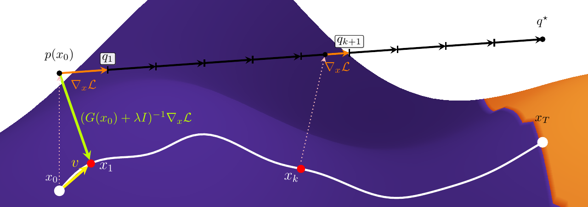
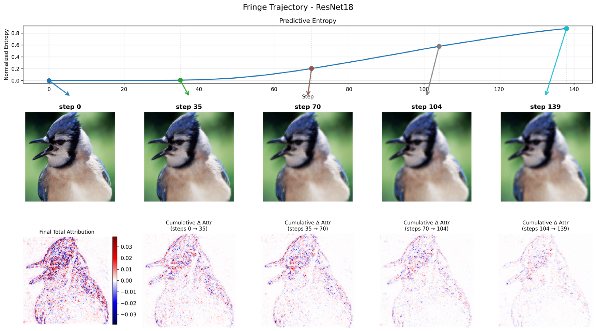
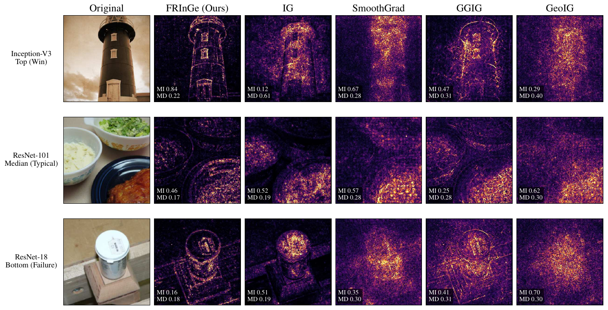

# FRInGe: Distribution-Space Integrated Gradients with Fisher–Rao Geometry

**FRInGe** is a gradient-based attribution method whose reference and
interpolation schedule are defined in the model's predictive distribution
space. It replaces a hand-designed input baseline with a maximum-entropy
predictive reference, follows a Fisher–Rao geodesic on the probability simplex,
and realizes that path in input space through a regularized pullback Fisher
metric.

<p align="center">
  
</p>

<p align="center"><em>
FRInGe prescribes a predictive-space geodesic and tracks its waypoints through
the classifier's pullback geometry.
</em></p>

> **Research-code status.** This release contains the exact benchmark-facing
> FRInGe code, competitor implementations, configurations, and shared metrics
> used in the paper workspace. Unless explicitly stated, the competitor files
> are not claimed to be the original authors' official repositories.

## Why FRInGe?

Standard Integrated Gradients requires an input-space baseline and usually
follows a Euclidean straight line. FRInGe changes this construction in five
steps:

1. use the uniform categorical distribution as a maximum-entropy predictive
   endpoint;
2. connect the prediction to that endpoint with a Fisher–Rao geodesic;
3. map each predictive waypoint to an input update through the pullback Fisher
   metric;
4. stabilize the update with damping, spatial regularization, a Fisher/KL trust
   region, and a Euclidean step cap; and
5. integrate the target-score gradient along the realized input trajectory.

Full categorical FRInGe solves the inner linear system with preconditioned
conjugate gradients without forming the input-space Fisher matrix. FRInGe-B
collapses the predictive distribution to target versus rest and exploits the
resulting rank-one pullback. Its unsmoothed natural-gradient direction is
closed form; the spatially regularized version uses structured inverse solves.

## Canonical implementation

The paper benchmark imports
[`methods/FisherRaoIG/FisherRaoIntegratedGradients.py`](methods/FisherRaoIG/FisherRaoIntegratedGradients.py).
Its `binary=False` branch is categorical FRInGe. Setting `binary=True`
delegates to
[`methods/FisherRaoIG/BinaryFisherRaoIntegratedGradients.py`](methods/FisherRaoIG/BinaryFisherRaoIntegratedGradients.py),
which implements FRInGe-B. The binary file is therefore a required backend of
the canonical class, not an alternative release.

<p align="center">
  
</p>

## Paper benchmark suite

The `methods/` directory contains one package per independently evaluated
method:

| Method | Package | Paper placement | Implementation status |
|---|---|---|---|
| FRInGe / FRInGe-B | `methods/FisherRaoIG/` | Main | Project implementation |
| Integrated Gradients | `methods/IG/` | Main | Captum wrapper used in the benchmark |
| SmoothGrad | `methods/SmoothGrad/` | Main | Project benchmark implementation |
| Guided IG | `methods/GuidedIG/` | Main | Project benchmark implementation |
| IG² | `methods/IG2/` | Main | Project benchmark implementation |
| Adversarial Gradient Integration | `methods/AdversarialIG/` | Main | Project benchmark implementation |
| GGIG | `methods/GGIG/` | Main | Project benchmark implementation |
| GeoIG | `methods/GIG/` | Main | Adapter around vendored upstream source |
| BlurIG | `methods/BlurIG/` | Appendix | Project benchmark implementation |
| Expected Gradients | `methods/ExpectedGradients/` | Appendix | Captum-based implementation with an empirical reference pool |
| Manifold Integrated Gradients | `methods/MIG/` | Appendix | Project port using a pretrained image autoencoder |

The provenance and important methodological qualifications are recorded in
[`methods/README.md`](methods/README.md). In particular, the MIG port uses a
pretrained `AutoencoderKL` rather than retraining the original paper's
dataset-specific VAE; that difference must be retained when interpreting the
comparison.

## Qualitative comparison

<p align="center">
  
</p>

The figure contains a strong case, a typical case, and a representative failure
case. `MI` and `MD` denote image-level MAS-Insertion and MAS-Deletion. Across the
six ImageNet architectures in the paper, FRInGe's clearest advantage is on the
calibration-oriented MAS metrics; perturbation AUC results are more mixed.

## Repository layout

```text
methods/       FRInGe and one package per competitor
evaluation/    Shared attribution metrics
common/        Shared model and image utilities
configs/       Exact method and ablation configurations
assets/        Selected paper figures for documentation
examples/      Small example images
notebooks/     Interactive FRInGe and FRInGe-B sanity check
data/          Local dataset mount point; ImageNet is not distributed
```

## Installation

Python 3.10 or newer is recommended. A CUDA-capable GPU is strongly recommended
for full experiments because FRInGe performs repeated Jacobian-vector products
and iterative linear solves.

```bash
git clone https://github.com/GabMartino/FRInGe.git
cd FRInGe
python3 -m venv .venv
source .venv/bin/activate
python -m pip install --upgrade pip
python -m pip install -r requirements.txt
```

Torchvision downloads pretrained ImageNet weights on first use. MIG separately
downloads `stabilityai/sd-vae-ft-mse` through Diffusers. GeoIG uses vendored
source but still requires the dependencies declared in `requirements.txt`.

Check that an entry point and its Hydra configuration resolve without starting
an experiment with:

```bash
python -m methods.FisherRaoIG.FisherRaoIG_benchmarking --cfg job --resolve
```

## Quick start

For a visual end-to-end check of both FRInGe variants, open
[`notebooks/FRInGe_quickstart.ipynb`](notebooks/FRInGe_quickstart.ipynb). It
loads the released configurations, runs both methods on an included image, and
reports completeness and FRInGe-B endpoint diagnostics. Jupyter is an optional
interface dependency:

```bash
python -m pip install jupyterlab
jupyter lab notebooks/FRInGe_quickstart.ipynb
```

This example explains a pretrained ResNet-18 top-1 prediction with categorical
FRInGe and the paper's ResNet-18 parameters:

```python
import torch

from common.utils import load_image, load_model
from methods.FisherRaoIG.FisherRaoIntegratedGradients import (
    FisherRaoIntegratedGradients,
)


device = "cuda" if torch.cuda.is_available() else "cpu"
model, preprocess = load_model("resnet18", device=device)
x = load_image("examples/n01580077_jay.JPEG", preprocess, device=device)

with torch.no_grad():
    target = model(x).argmax(dim=1)


def target_score(inputs: torch.Tensor, targets: torch.Tensor) -> torch.Tensor:
    return model(inputs).gather(1, targets[:, None]).squeeze(1)


explainer = FisherRaoIntegratedGradients(
    model=model,
    model_forward=target_score,
    target_idx=target,
    cg_max_iters=20,
)

attributions, completeness_delta = explainer.attribute(
    x=x,
    kl_target=3.0339e-4,
    fisher=True,
    binary=False,
    delta_euc=0.61337,
    eta_max=13.56315,
    use_sobolev_preconditioner=True,
    lambda_ratio=4.7707e-11,
    smoothing=True,
    gamma_step=0.0099739,
    gamma_prior=0.00097495,
)

print(attributions.shape)
print("Mean absolute completeness residual:", completeness_delta)
```

The categorical and binary parameter sets for all six architectures are in
[`configs/ablation/3_fisher_smooth.yaml`](configs/ablation/3_fisher_smooth.yaml)
and
[`configs/ablation/fringe2_binary.yaml`](configs/ablation/fringe2_binary.yaml).
These are experiment-specific settings, not universal defaults.

## Running experiments

Place evaluation images under `data/ImageNet/` or override the corresponding
Hydra path. Run all commands from the repository root. For example:

```bash
python -m methods.FisherRaoIG.FisherRaoIG_benchmarking
python -m methods.FisherRaoIG.FisherRaoIG_benchmarking \
  ablation=fringe2_binary
python -m methods.IG.IG_benchmarking
python -m methods.ExpectedGradients.ExpectedGradients_benchmarking
```

The remaining competitors follow the same convention:

```bash
python -m methods.SmoothGrad.SmoothGrad_benchmarking
python -m methods.GuidedIG.GuidedIG_benchmarking
python -m methods.IG2.IG2_benchmarking
python -m methods.AdversarialIG.AdversarialIG_benchmarking
python -m methods.GGIG.GGIG_benchmarking
python -m methods.GIG.GIG_benchmarking
python -m methods.BlurIG.BlurIG_benchmarking
python -m methods.MIG.MIG_benchmarking
```

Each runner reads its corresponding YAML file in `configs/`, uses the same
model/image utilities and evaluation package, and creates its configured output
directory under `results/methods/`. Generated results are ignored by Git and are
not part of this source release.

## Reproducibility boundaries

- The released source files are the benchmark imports used in the paper
  workspace after its package reorganization.
- The reported benchmark environment used PyTorch 2.8.0, torchvision 0.23.0,
  and CUDA 12.8.
- Preprocessing, target definition, reference distributions, stochastic sample
  counts, and metric perturbations are explicit in `configs/` and must be
  reported with results.
- Expected Gradients requires a genuinely disjoint reference pool for a final
  scientific run. Its local fallback reuses the evaluation directory and emits
  a warning; it is a smoke-test convenience, not a valid publication protocol.
- Runtime comparisons are hardware- and batching-dependent. Running the default
  configurations does not by itself constitute a controlled speed comparison.
- The exact Diffusers version used for the original MIG run was not captured in
  the archived environment metadata, so that dependency is intentionally not
  presented as fully pinned.

## Paper and citation

The accompanying manuscript is titled **“FRInGe: Distribution-Space Integrated
Gradients with Fisher–Rao Geometry.”** A public paper link and BibTeX entry will
be added when the preprint is released. Until then, please cite the repository
URL and record the exact Git commit.

## Questions and issues

Please use the [GitHub issue tracker](https://github.com/GabMartino/FRInGe/issues)
for reproducible bug reports and questions.
